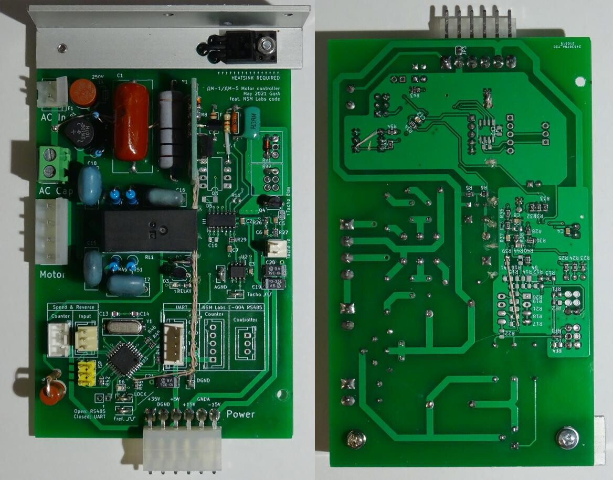
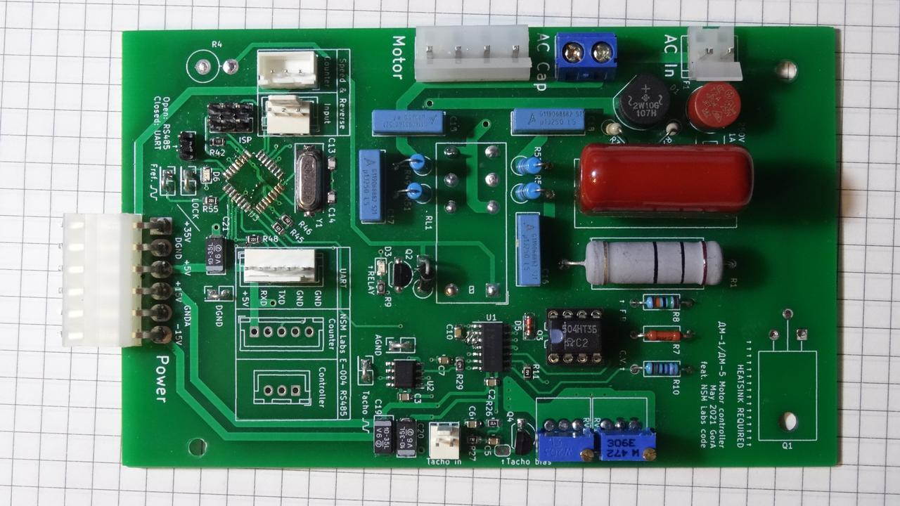

# Краткое описание rev0

Ревизия 0 - опытная печатная плата, на которой разведена схема аналогового
перемножителя на м/сх К504НТ3, обеспечивающего формирование синусоидального тока
двигателя.

[Схема этой платы](./main.pdf).

Схема ФАПЧ была заменена микроконтроллером.

Эта схема имеет ряд недостатков, основными из которых являются:
* Сложность в наладке;
* Трудонодоступность К504НТ3 и прочих полевых сборок;
* Схема обеспечивает модуляцию только при работе от переменного тока
синусоидальной формы.

# Картинки (макет rev1, rev0)

Так выглядит плата rev0, с доработками, которые вошли в rev1.

Перпендикулярно распаянная макетная плата вблизи металлического уголка -
детектор перехода сетевого напряжения через 0 (Zero Crossing Detector),
необходимый для подстройки синтезируемого выпрямленного синуса к периоду
сетевого напряжения.

Вместо аналогового перемножителя распаян преобразователь напряжения в ток,
через который посредством фильтрованного PWM "напрямую", линейно управляет
микроконтроллер. Это позволяет осуществить модуляцию выхода PID-регулятора
модулем синуса программно, и тем самым избавиться от труднодоступной
транзисторной сборки К504НТ3 и её обвязки, нуждающейся в регулировке.

Дополнительный положительный побочный эффект такого решения заключается в
возможности работы этой схемы с переменным током формы, отличной от
синусоидальной (например, с трехступенчатой формой от ИБП).

Останки ревизии 0, собранные с аналоговым перемножителем-модулятором, для
истории.

