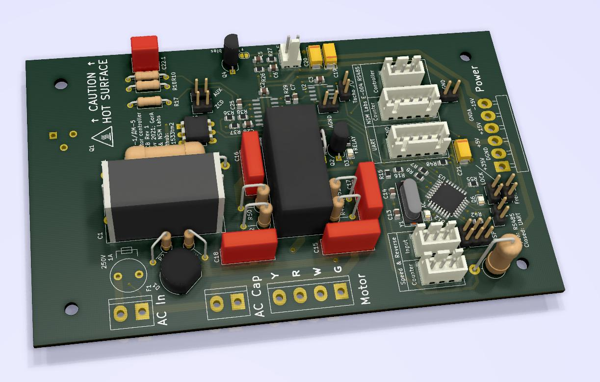

# Краткое описание rev1

Ревизия 1 - первая "чистовая" печатная плата.

[Схема этой платы](./main.pdf).

Основные моменты:
* Сложная оригинальная схема петлевого фильтра, модулятора тока и силового
каскада полностью заменена на фильтр ШИМ с преобразователем V→I с применением
полевого транзистора.
* Модуляция синусом реализована таблично и воздействует на выход PID-регулятора.
* Интервал полупериода сетевого напряжения снимается посредством схемы ZCD с
обмотки трансформатора, питающей ведущий двигатель.
* Номиналы схемы ZCD эмпирически подобраны так, чтобы при трехступенчатой форме
сетевого напряжения (с ИБП) схема стабильно формировала лог.0 при "ступеньке"
0В.

# Картинки

To be continued...
